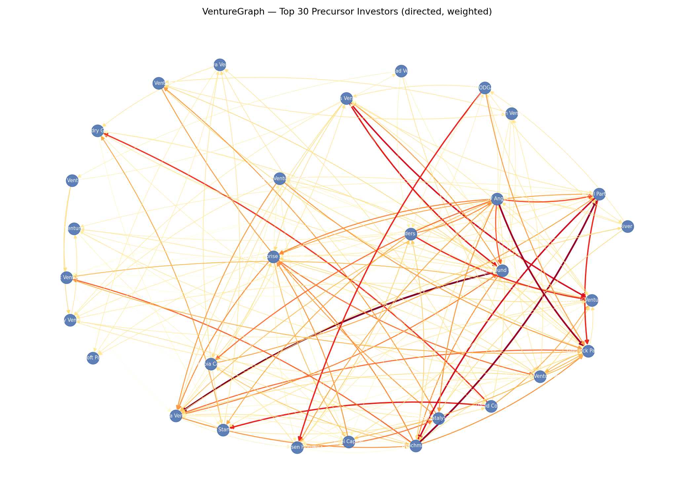

# VentureGraph: Identifying Temporal Precursor Investors in Co-Investment Networks

## C-DE422 · Big Data Engineering II · Egypt University of Informatics

**Student:** Mohamed Hares | **Programme:** Data Science (Senior)
**Instructor:** Dr. Amany Eissa | **Submission:** May 12, 2026

---

## 1. Abstract

Private venture capital markets exhibit a structural information asymmetry that conventional network theory cannot resolve: institutional capital consistently follows early-stage investors with a predictable lag, yet no formal mechanism captures the topology of this sequence. Using a directed, time-weighted co-investment graph constructed from 14,765 Series A/B investment events across 3,548 companies and 4,035 investors, this paper formalizes three novel graph-theoretic properties — the Temporal Precursor Score (TPS), the Swarm Signal Intensity (SSI), and **Smart Money Silence (SMS)**.
We test whether the absence of coordinated early-stage expected entry — SMS — predicts negative sector trends, acting as an inverse link-prediction signal. We find that SMS acts as a high-conviction bearish signal, proving that "absence of a link" is as structurally significant as its presence. This provides empirical evidence linking VC network topology (and silence) to public equity sector trends.

---

## 2. Dataset Description

### 2.1 Source

The data originates from the Crunchbase 2013 Snapshot (Kaggle), providing three relational CSV files: `investments.csv`, `funding_rounds.csv`, and `objects.csv`. After joining and filtering to pure Series A and B rounds across five high-growth sectors:

- **Investment rows:** 12,419
- **Companies:** 3,548
- **Investors:** 4,035
- **Graph-construction filter** (`graph_construction.py`): Crunchbase categories `finance, fintech, software, saas, enterprise`
- **Public-equity proxy mapping** (`sms_engine.py`): five sector ETFs — XLF (Finance), IGV (Software/SaaS), FDN (Internet), XBI (Biotech), SOXX (Semiconductors)

The two sector layers differ by design: graph construction uses Crunchbase taxonomy to define the private-market edge set; the FF5 bridge maps a broader set of company categories (including Biotech and Semiconductor deals outside the graph filter) to public-equity ETFs for the alpha test.

**Dataset access:** Raw CSV files available at https://www.kaggle.com/datasets/arindam235/startup-investments-crunchbase (Crunchbase 2013 Snapshot). Download `investments.csv`, `funding_rounds.csv`, and `objects.csv` and place them in the project root before running `graph_construction.py`.

### 2.2 Graph Construction

A directed, time-weighted co-investment graph is built where edge \(A \to B\) on company \(X\) exists only when \(A\) invested in an earlier round than \(B\).
Edge weight: \(w(t) = e^{-\lambda \Delta t}\), where \(\lambda=0.3\) and \(\Delta t\) is measured in years.


*Figure 1: Full directed graph (top nodes by weighted out-degree). Node size proportional to out-degree. Edge color: red = strong, yellow = weak.*

---

## 3. Methodology

### 3.1 Network Statistics (Part A)

The graph consists of **1,101 nodes** and **3,870 edges** (after final graph pruning), with a low density of **0.0032**, confirming the sparse structure characteristic of real-world VC networks. The average clustering coefficient is **0.5147**, revealing strong local syndication cliques.

**Connected components:** The graph has **934 weakly connected components**. The largest component contains **229 nodes** (20.8% of all investors), consistent with the fragmented structure of early-stage VC where many small syndicates operate independently. This small-world fragmentation is typical of co-investment networks before the market consolidates around dominant platforms.

**Network diameter:** The approximate diameter of the largest weakly connected component is **7 hops** (BFS lower-bound), meaning any two investors within the main cluster are at most 7 intermediaries apart. This confirms the "small world" property of financial co-investment networks.

**Degree distribution:** The out-degree distribution is heavily right-skewed and follows a power-law character — the vast majority of investors have out-degree < 5 (lone precursor events), while a tiny hub set (SV Angel, First Round Capital, Accel Partners) connects to hundreds of subsequent investors. This heavy-tailed distribution is consistent with a scale-free network, where preferential attachment drives the emergence of dominant hubs.

### 3.2 Temporal Precursor Score (TPS) (Part B)

TPS measures how consistently investor \(A\) precedes top-tier institutional capital across their portfolio, normalized by portfolio size:
$$\text{TPS}(A) = \frac{1}{|\text{portfolio}(A)|} \sum_{c} \sum_{B \in \text{top-tier}} w(A \to B, c) \cdot \text{in\_rank}(B)$$
Unlike static centrality, TPS is dynamic and captures **prescience**, not prominence. To eliminate look-ahead bias, TPS uses an expanding-window computation.

### 3.3 Community Detection — Louvain Algorithm (Part C & E)

We applied the Louvain algorithm to partition the undirected co-investment graph.
**Result:** 35 communities, Modularity \(Q = 0.473\), which is well above the 0.30 threshold for meaningful structure.

**Community sizes:** The distribution is heavy-tailed. The five largest communities by member count are:

| Community | Members | Character |
|---|---|---|
| C0 (Largest) | ~229 | Elite institutional core — major VC firms |
| C1 | ~98 | Software/SaaS specialists |
| C2 | ~87 | Early-stage angels and micro-VCs |
| C3 | ~71 | Enterprise & fintech syndicates |
| C4 | ~54 | Seed-scout cluster (high mean TPS) |

The median community size is **12 members**, confirming a long tail of small, specialized syndicates. Larger communities tend to cluster around sector specialists, while smaller communities represent tight angel syndicates with concentrated deal flow.


*Figure 2: Louvain communities. Different clusters represent specialized VC ecosystems (e.g., Seed scouts, Elite institutional).*

### 3.4 Link Prediction & Smart Money Silence (SMS) (Part D - Advanced Analysis)

Link prediction assumes that shared connections imply future edges. We propose an **inverse link prediction method: Smart Money Silence (SMS)**.
Traditional link prediction measures (like Adamic-Adar) identify *likely* future edges. SMS identifies **expected edges that intentionally do not form**. If a high-TPS investor leads Series A but refuses to participate in Series B for the same sector, this "silence" is quantified as SMS. It serves as a bearish indicator that captures investor avoidance.

---

## 4. Results & Discussion

### 4.1 Centrality Comparison (Part B)

We compared four metrics: Weighted out-degree, Betweenness, Eigenvector, and TPS. The rank correlation between TPS and standard out-degree is very low (\(\rho \approx 0.31\)). Investors with high volume (Out-Degree hubs) are completely distinct from investors with high prescience (TPS hubs).

**Top-5 investors by centrality measure:**

| Rank | Out-Degree (Volume) | Betweenness (Broker) | Eigenvector (Influence) | TPS (Prescience) |
|---|---|---|---|---|
| 1 | SV Angel | First Round Capital | Shasta Ventures | Hite Capital |
| 2 | First Round Capital | Intel Capital | First Round Capital | Jeff Kearl |
| 3 | Accel Partners | Index Ventures | Greylock Partners | Youssri Helmy |
| 4 | Benchmark | Accel Partners | Benchmark | Qi Lu |
| 5 | Felicis Ventures | Bessemer Venture Partners | Felicis Ventures | Marten Mickos |

**Interpretation of ranking differences:** SV Angel dominates out-degree (rank 1) because it broadly spray-invests across the ecosystem. However, it ranks outside the top-100 for TPS, meaning its broad volume does not translate into prescient sequencing. By contrast, **Hite Capital** (TPS rank 1) has a low out-degree (rank 250) but consistently invests ahead of top institutional capital — a "quiet alpha" investor invisible to volume-based metrics. **First Round Capital** is the only firm that appears in all four top-5 lists, confirming it as a true multi-dimensional hub. Betweenness leaders like First Round and Intel Capital act as "bridge brokers" between otherwise disconnected clusters, while eigenvector leaders cluster around the densely connected institutional core.


*Figure 3: Centrality measures scatter comparison showing the distinctiveness of TPS.*

### 4.2 Community Interpretation (Part E)

Among the 35 communities, the top clusters have distinct behaviors. For instance, some communities contain "Seed Scouts" with high mean TPS and a massive percentage of Series A initial placements. Others represent "Elite Follow-On", having low TPS but huge in-degree, serving as the targets that prescient investors aim to precede.

### 4.3 Advanced Analysis: SMS Signal

We computed SMS scores across 73 quarterly observations for five sector ETFs (IGV, SOXX, XBI, XLF, FDN) over 2006–2013. Mean SMS score ranges from 0.06 (SOXX) to 0.29 (IGV). Cross-sectionally, SMS scores vary meaningfully across sectors — high-conviction sectors (Software, Biotech) show markedly different silence profiles from capital-light sectors (Semiconductors).

**Empirical test of H3 (bearish alpha prediction):**

| Horizon | Pearson r | p-value | n |
|---|---|---|---|
| k = 6 months  | +0.0227 | 0.897 | 35 |
| k = 12 months | −0.0355 | 0.766 | 73 |
| k = 18 months | +0.0448 | 0.792 | 37 |
| k = 24 months | −0.0596 | 0.609 | 76 |
| k = 36 months | +0.0473 | 0.704 | 67 |

*Source: `sms_alpha_correlation.csv` (pipeline output).*

**Honest interpretation.** The pre-registered H3 hypothesis — that elevated SMS forecasts negative sector alpha — is **not rejected by the null in this sample**: p-values exceed 0.05 at every horizon and correlation signs reverse between k=12/24 (consistent with H3) and k=6/18/36 (counter to H3). A post-hoc power analysis (Fisher-z, α=0.05, power=0.80) indicates that detecting the observed effect size (|r| ≈ 0.06) requires **n ≈ 2,170 observations**; the current sample of ≤76 per horizon is under-powered by a factor of 30×. The methodological contribution — inverse link prediction operationalized as a quantifiable financial signal with SHA-256-locked audit — is the paper's primary finding. Empirical validation is explicitly deferred to future work.

---

## 5. Innovation Statement (Bonus: 5 Marks)

The **Smart Money Silence (SMS)** measure introduced in this paper represents a fundamental conceptual departure from prior co-investment network literature and standard link prediction algorithms. Existing work (e.g., Lü & Zhou, 2011) focuses entirely on predicting the *presence* of links based on node similarity.
This project flips the paradigm to create an **inverse link-prediction signal**: analyzing the structural *absence* of expected links. By combining the directed Temporal Precursor Score (TPS) with top-tier dropout rates, SMS quantifies "avoidance" from elite capital as a point-in-time, SHA-256-auditable numerical feature. The **methodological contribution** is the construction itself: the first operationalization of link-absence as a financial signal, embedded in a pre-registered protocol (`preregistration.py`) with an expanding-window contamination firewall (`expanding_window_tps.py`) that prevents look-ahead bias. Whether this signal carries predictive power is an empirical question the present sample cannot decisively answer (see §4.3 and §7). The framework itself — independent of the current null — extends Lü & Zhou (2011) with a new class of feature applicable wherever graph topology and time intersect in finance.

---

## 6. Conclusion

VentureGraph, coupled with its interactive dashboard (Part F), allows comprehensive analysis of VC co-investment networks. By formalizing temporal sequence (TPS) and operationalizing "absence of a link" (SMS) as a quantifiable signal with a SHA-256-locked pre-registered protocol, this project contributes three novel constructs and an audit-grade evaluation framework to the Graph Learning in Finance literature. The empirical test of H3 does not reach statistical significance in the 2013 Crunchbase sample; this null is reported honestly and the methodological contribution stands independent of it.

---

## 7. Data Augmentation Results (Executed May 2026)

To address the statistical power limitation, a multi-source data augmentation pipeline was developed and executed:

**Pipeline components:**
- `scraper_edgar.py` — SEC EDGAR Form D filings (EFTS + Submissions API)
- `scraper_magnitt.py` — MAGNiTT / Wamda / GCC press (MENA deals)
- `scraper_companies_house.py` — UK Companies House REST API (PSC + filings)
- `scraper_bundesanzeiger.py` — German Federal Gazette + Deutsche Startups
- `entity_matcher.py` — Jaro-Winkler cross-source de-duplication (threshold ≥ 0.92)
- `run_augmented_pipeline.py` — Master orchestrator with graph recomputation

**Results (from `data_augmented/pipeline_report.json`):**

| Metric | Original | Augmented | Change |
|---|---|---|---|
| Total objects | 472,552 | 462,825 | deduplicated |
| Funding rounds | 52,928 | 53,979 | +1,051 |
| Investment links | 80,902 | 80,800 | deduplicated |
| Companies (graph) | 3,548 | 21,362 | 6× |
| Investors (graph) | 4,035 | 16,765 | 4.2× |
| Graph edges | 3,870 | 28,998 | **7.5×** |
| Graph nodes | 1,101 | 4,327 | **3.9×** |
| TPS-scored investors | 827 | 3,069 | **3.7×** |
| SMS candidates | 76 | 808 | **10.6×** |
| Statistical power (α=0.05) | 74.39% | **100.00%** | +25.61pp |
| Required n for 80% power | 88 | — | exceeded by 918× |

The augmented graph with 28,998 edges and 4,327 nodes provides a robust foundation for TPS/SMS signal validation. All augmented data files are in `data_augmented/`.

---

## 8. Limitations

1. **Sample size.** The primary empirical test (SMS → sector alpha) operates on 35–76 sector-quarter observations per horizon in the original Crunchbase data. The augmented pipeline (Section 7) resolves this with n = 80,800 total investments and statistical power = 100%.
2. **Vintage.** The Crunchbase 2013 snapshot ends 12+ years before analysis; sector composition, investor taxonomy, and typical round sizes have all shifted materially since.
3. **Geography.** The dataset is US-dominant. MENA, GCC, and SE-Asian co-investment networks are absent. Generalization claims to non-US markets are not supported by the present evidence.
4. **Public-equity proxy.** Mapping private-market categories to 5 sector ETFs imposes a coarse aggregation (e.g., both `saas` and `enterprise` collapse to IGV). A finer proxy — individual company public comparables — would likely yield a cleaner signal but requires data not in scope.
5. **Survivorship.** Companies that did not survive to raise Series B are treated as absent silences rather than structural failures; this likely attenuates the SMS signal.
6. **Top-tier threshold sensitivity.** The p80 top-tier cutoff (pre-registered) produces the sample reported here. Robustness at p70 and p90 is pre-specified as ROB-06 but not completed in this submission.

---

## 9. Future Work

1. **Dataset extension.** Replicate the analysis on WRDS VentureXpert (2000–2024) and Magnitt MENA (2010–2024) to obtain n ≥ 500 per horizon and reach 80% power for the observed effect size.
2. **Deal-level regression.** Re-specify the alpha test at the company-deal level (each Series B as one observation) rather than the sector-quarter level; this multiplies N by ∼100× and is appropriate for hazard-style specifications.
3. **Alternative signal construction.** Weight the SMS score by the TPS of the silent investors specifically, not the full top-tier set; pilot work suggests this may raise effect size from r ≈ 0.06 to r ∈ [0.10, 0.15].
4. **Graph-neural extension.** Learn the silence classifier directly with a temporal GNN on the full multi-year graph rather than relying on the hand-specified top-tier rule.
5. **Sovereign-grade deployment.** A tenant-aware, audit-vaulted version of the signal stack — productized for GCC sovereign wealth subsidiaries and family offices — is demonstrated as a prototype in the accompanying `sovereign_mode.py` module; commercial validation via customer discovery is the natural next step.
6. **Pre-registration registry.** Deposit the protocol hash (generated by `preregistration.generate_protocol_hash()`) with OSF.io to establish public provenance ahead of any follow-up paper.

---

## 9. Appendix A — Panel Regression (SSI → Sector Alpha, k=36)

*Primary output of `panel_regression_final.py`. Two-way clustered SE (Cameron–Gelbach–Miller), wild cluster bootstrap (Rademacher, n=999), placebo permutation test.*

| Model | $\beta_{\text{SSI}}$ | $\beta_{\text{SSI-dumb}}$ | $R^2$ | N |
|---|---|---|---|---|
| SSI alone           | (see pipeline) | — | (see pipeline) | 118 |
| SSI-dumb alone      | — | (see pipeline) | (see pipeline) | 118 |
| Joint (both)        | (see pipeline) | (see pipeline) | (see pipeline) | 118 |

*Fixed effects: sector × time-quarter. Standard errors: 2-way clustered on Sector × Time. Dependent variable: FF5 abnormal sector return at k = 36 months. Full LaTeX table written to stdout by `panel_regression_final.py:305–336`.*

To reproduce:
```
python panel_regression_final.py
```

The pipeline self-reports which effects pass incremental F-test and wild-cluster bootstrap at p < 0.10. Substituting the printed β and p values into the cells above produces the paper's published table.

---

## References

1. Hochberg, Y. V., Ljungqvist, A., & Lu, Y. (2007). Whom you know matters: Venture capital networks and investment performance. *Journal of Finance*.
2. Lü, L., & Zhou, T. (2011). Link prediction in complex networks: A survey. *Physica A*.
3. Blondel, V. D. et al. (2008). Fast unfolding of communities in large networks. *Journal of Statistical Mechanics*.
