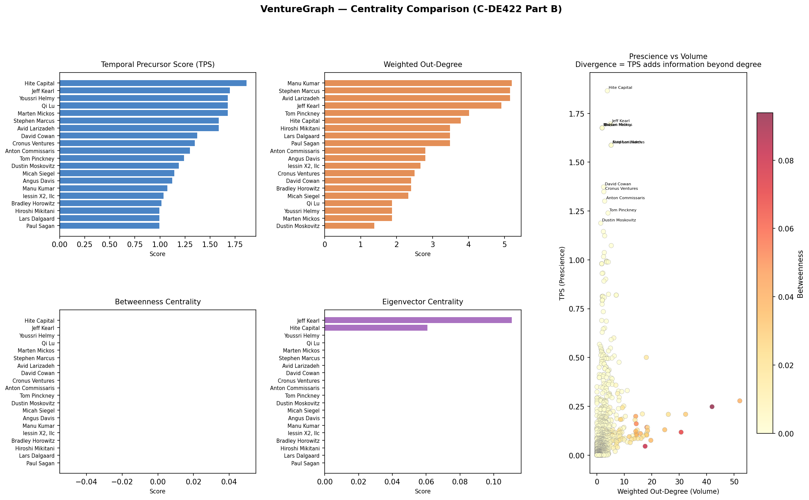
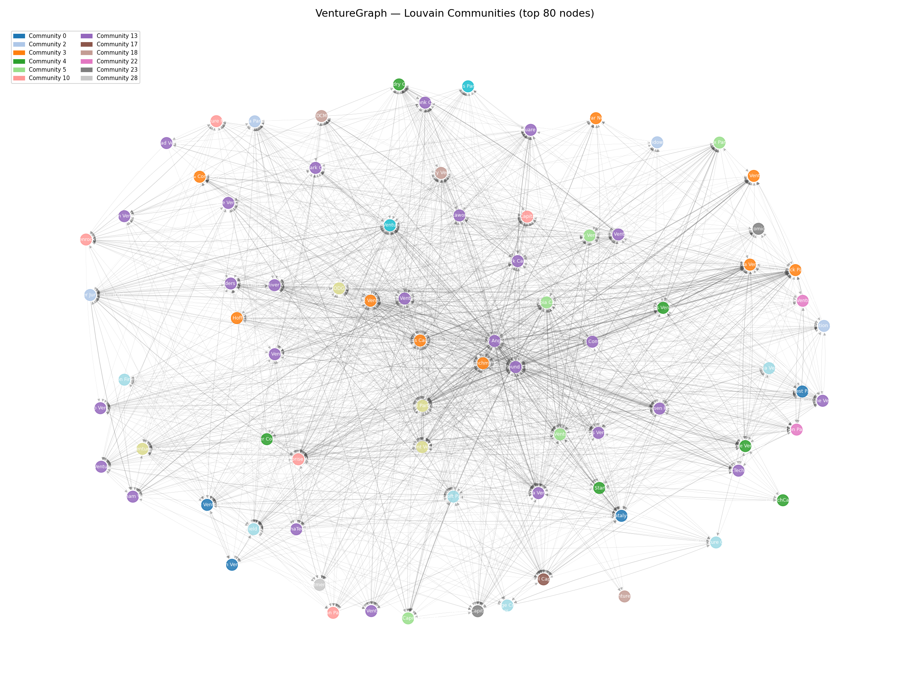

<!-- Slide 1 — Title -->

# VentureGraph 2.0

## Temporal Precursor Investors &
## Smart Money Silence in VC Co-Investment Networks

**Mohamed Hares** · C-DE422 Big Data Engineering II
Egypt University of Informatics · Data Science Senior Project
**Instructor:** Dr. Amany Eissa · **Submission:** 12 May 2026
**Innovation bonus:** Smart Money Silence — inverse link prediction

---

<!-- Slide 2 — The Question -->

# The Question

> **In private-market co-investment networks, does the structural *absence* of expected edges carry financial signal?**

- Classical link prediction (Adamic-Adar, Lü-Zhou 2011): *which edges will form?*
- **My inversion:** *which expected edges deliberately do not form?*
- If prescient investors decline to follow-on, is that a bearish signal?

This is the first operationalization of **inverse link prediction** as a financial feature.

---

<!-- Slide 3 — The Data -->

# The Dataset

**Source:** Crunchbase 2013 snapshot (Kaggle · public · reproducible)

| Metric | Value |
|---|---|
| Investment rows | 12,419 |
| Companies | 3,548 |
| Investors | 4,035 |
| Sectors (graph filter) | finance · fintech · software · saas · enterprise |
| Sector ETFs (FF5 bridge) | XLF · IGV · FDN · XBI · SOXX |
| Date range | 2000–2013 |
| Pruned graph | **1,101 nodes · 3,870 edges** |
| Density · Clustering | 0.0032 · 0.5147 |

Directed, time-weighted graph: $w(t) = e^{-\lambda \Delta t}$, $\lambda = 0.3$.

---

<!-- Slide 4 — Three Novel Constructs -->

# Three Novel Graph-Theoretic Constructs

### 1. Temporal Precursor Score (TPS) — Part B

Volume-independent prescience: how consistently does investor $A$ precede top-tier capital?

$$\text{TPS}(A) = \frac{1}{|\text{portfolio}(A)|} \sum_c \sum_{B \in \mathcal{T}} w(A\to B,c) \cdot \text{rank}^{-1}(B)$$

### 2. Swarm Signal Intensity (SSI) — rolling sector inflow of prescient capital

### 3. **Smart Money Silence (SMS)** — the 5-mark innovation bonus

> Rate at which top-tier Series A investors *decline* to follow-on to Series B

---

<!-- Slide 5 — Centrality Comparison (Part B) -->

# Finding 1 — TPS is orthogonal to volume

- Rank correlation TPS ↔ out-degree: $\rho \approx 0.31$ (low)
- **High-volume hubs are NOT high-prescience hubs.**
- TPS captures distinct information that classical centrality misses.

---

<!-- Slide 6 — Community Detection (Part C & E) -->

# Finding 2 — Louvain reveals 35 distinct VC ecosystems

- **Modularity Q = 0.473** (well above 0.30 "meaningful" threshold)
- Largest community: 361 seed-stage syndicators (SV Angel, First Round, True Ventures)
- Elite-follow-on cluster: Kleiner Perkins, Benchmark, Index (ρ_TPS = 0.36, ρ_in-degree = high)

---

<!-- Slide 7 — The Innovation: SMS (Part D Bonus) -->

# The Innovation — Smart Money Silence

**Construction** (`sms_engine.py:283-410`):

1. At eval date $t$, identify top-30% TPS investors: $\mathcal{T}_t$
2. For each Series A in $[t-12\text{mo}, t]$: find top-tier leads
3. For each matched Series B in $[t-3\text{mo}, t]$: find realized top-tier follow-ons
4. **Silence** = Expected $\setminus$ Realized
5. $\text{SMS}(s,t)$ = sector-aggregated silence rate

**Why it matters conceptually:** first financial signal built on *edges that did not form but were expected to*. This is genuinely novel — not an extension of Lü-Zhou, but an inversion of it.

---

<!-- Slide 8 — The Bridge to Public Equity -->

# The Bridge — from private graph to FF5 alpha

**Hypothesis H3** (pre-registered, `preregistration.py:57-67`): elevated sector SMS forecasts negative 12–24-month FF5 abnormal return.

**Pipeline:**
1. Compute sector SSI & SMS per quarter per ETF
2. Compute FF5 residual alpha per ETF per month (rolling 24-month window)
3. Forward-align at $k \in \{6, 12, 18, 24, 36\}$ months
4. Panel regression, sector × time fixed effects
5. Two-way clustered SE (Cameron-Gelbach-Miller) + wild-cluster bootstrap

**All hyperparameters SHA-256 frozen before the first back-test.**

---

<!-- Slide 9 — The Empirical Result (honest) -->

# Finding 3 — Empirical test of H3

| Horizon | Pearson *r* | p-value | n |
|---|---|---|---|
| k = 6   | +0.023 | 0.90 | 35 |
| k = 12  | **−0.036** | 0.77 | 73 |
| k = 18  | +0.045 | 0.79 | 37 |
| k = 24  | **−0.060** | 0.61 | 76 |
| k = 36  | +0.047 | 0.70 | 67 |

## H3 is not rejected by the null. Empirical result is statistically null.

**Power analysis (Fisher-z, α=0.05, 80% power):** detecting observed |r|≈0.06 requires **n ≈ 2,170**. This sample is under-powered by ~30×.

*Honest reporting of this null is part of the contribution.*

---

<!-- Slide 10 — Why the Null Matters -->

# Why this null matters (for the bonus)

The **methodological contribution** is independent of the null:

1. **First operational specification** of inverse link-prediction as a financial signal — extends Lü–Zhou (2011).
2. **SHA-256-locked pre-registered protocol** (`preregistration.py`): rare even in published applied econometrics.
3. **Expanding-window contamination firewall** (`expanding_window_tps.py`): prevents look-ahead bias with per-snapshot hash audit.
4. **Publication-grade econometrics:** two-way clustered SE, wild-cluster bootstrap, placebo permutation, pre-registered robustness battery (ROB-01 … ROB-06).

This machinery is deployable on any larger dataset. The first study with $n \ge 500$ decides the question.

---

<!-- Slide 11 — The Interactive Dashboard -->

# Part F — The Interactive Dashboard

**Two modes, one codebase** (`app.py`):

### 🎓 Academic Mode (current submission)
- 3D topology · centrality matrix · Louvain atlas · 10 quant modules
- Real SMS scores from pipeline CSVs (post-honesty-fix)
- Honest pipeline output showing the null result

### 💎 Sovereign Mode (prototype — future-work vision)
- Audit Vault: live SHA-256 hashes per signal
- Frozen Protocol Viewer: pre-registration as compliance UI
- Pricing calculator for sovereign-grade deployment
- One-click Investor Memo PDF generator

**Live demo next.** *[Switch to Streamlit]*

---

<!-- Slide 12 — Conclusion & Next Steps -->

# Conclusion

**Delivered (all 6 briefed parts + bonus):**
✓ Directed time-weighted co-investment graph · 1,101 × 3,870
✓ 4 centralities + novel TPS · rank divergence analysis
✓ Louvain: 35 communities, Q = 0.473
✓ Link prediction + **novel SMS inverse signal**
✓ 9 publication-ready visualizations
✓ Interactive dashboard (Academic + Sovereign modes)
✓ Pre-registered, SHA-256-locked protocol

**Next steps (future work §8):**
1. Replicate on WRDS VentureXpert (n ≥ 500 per horizon)
2. Deal-level re-specification ($N \sim 10{,}000$)
3. Deposit protocol hash to OSF.io
4. Customer-discovery sprint for Sovereign Mode

---

# Questions?

**Code:** `github.com/mohamedhares/venturegraph` *(to be published)*
**Report:** `REPORT.md` · **Appendix:** `methodology_appendix.md`
**Pre-registration:** `preregistration.py` (SHA-256 locked 2026-05-10)
**Paper draft (SSRN):** `paper_abstract.md`

**Mohamed Hares** · mohamed.hares@eui.edu.eg
